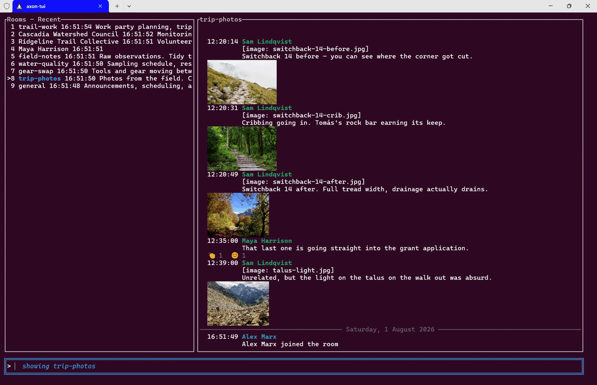
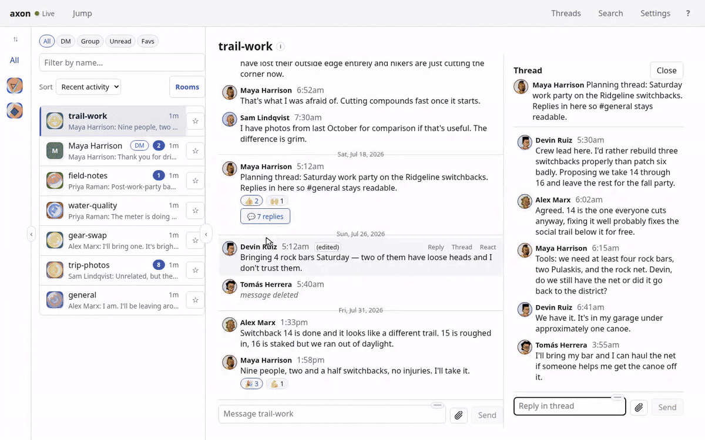

# Axon

Axon is a self-hosted personal agent for [Matrix](https://matrix.org).
It sits between your homeserver(s) and your clients, providing the persistent state, full-text search index, and per-device coherence that Matrix clients otherwise have to reinvent on every install.

Matrix's encrypted and decentralized architecture makes full client usability challenging.
This "middle" layer aims to solve that challenge.
It is similar to the [back-end for front-end](https://philcalcado.com/2015/09/18/the_back_end_for_front_end_pattern_bff.html) concept, with the added wrinkle that it is intended to run as a separate instance per user.
Old-timers may find a familiar with analogy with [ZNC Bouncer](https://en.wikipedia.org/wiki/ZNC), an agent that sits between an IRC client and an IRC server.

Axon differs from most clients by cleanly separating the end-user interface from the "hard" parts of the Matrix ecosystem: sync, E2EE decryption, and a full-history search index all live in Axon itself, not duplicated in every client — so a client can be wiped and reinstalled and be back to full functionality immediately, with no history to re-sync and no on-device index to rebuild.
That one persistent brain also covers multiple Matrix accounts (personal and work, even on different homeservers) under a single search index and open API, and resolves edits, reactions, and threads server-side so a late reaction to an old message is never silently dropped just because a client's timeline window has moved on.
Start composing a message on the mobile web app and continue that same draft instantly via the TUI on desktop.
No saving required.

Two reference clients consume that same open, versioned `/v1/` API today — [`axon-tui`](clients/tui/README.md), a keyboard-first terminal client, and [`axon-web`](clients/web/README.md), a desktop/mobile browser and (soon to be packaged) Tauri desktop client — proof that building a third is a client-only project, not a fork.
Check out our [client parity](docs/client-parity.md) document for the current implementation status of these clients and future roadmap.
And because Axon can be self-hosted on your own hardware or cloud instance rather than a SaaS holding your decrypted history, it's working toward a single-command setup that works painlessly on Linux, MacOS, or Windows: a Docker Compose stack that brings up Postgres, Axon, and the web client behind one front door, with Caddy handling TLS and a Tailscale profile for private remote access already built in.

## See it

[](https://matrix-axon.github.io/matrix-axon/demo.html#tui)

**[Watch the axon-tui demo](https://matrix-axon.github.io/matrix-axon/demo.html#tui)** (65s) — the room list, threads, inline photographs drawn as real terminal graphics, full-text search, and jump-to-date, all against a reproducible seeded world.

[](https://matrix-axon.github.io/matrix-axon/demo.html#web-desktop)

**[Watch the axon-web demos](https://matrix-axon.github.io/matrix-axon/demo.html#web-desktop)** — [desktop](https://matrix-axon.github.io/matrix-axon/demo.html#web-desktop) (101s): spaces, threads, image galleries with a lightbox, and search scoped, widened and narrowed again;
[mobile](https://matrix-axon.github.io/matrix-axon/demo.html#web-mobile) (62s) on an iPhone profile, where the single-pane layout makes the transitions the story.

Both clients read the same seeded world over the same `/v1/` API from the same live Axon.
The recordings live on the project site rather than inline here: GitHub renders repo-relative GIFs in a README but not MP4, and a GIF of any of these is both enormous and worse to look at.

Join our public discussion room [#axon-developer:bostoncoop.net](https://matrix.to/#/%23axon-developer%3Abostoncoop.net).

See [`docs/mvp/prd.md`](docs/mvp/prd.md) for a more complete product description, [`docs/mvp/tech-spec.md`](docs/mvp/tech-spec.md) for the architecture, and [https://matrix-axon.github.io/matrix-axon/api.html](https://matrix-axon.github.io/matrix-axon/api.html) for the latest OpenAPI specification.

## User quick start with Docker

Run the full Axon stack — server **and** the web client — from prebuilt images, with **no clone and no build**.
Images are public, so no `docker login` or credentials required.

**Prereqs:** [Docker](https://www.docker.com/products/docker-desktop/)

```sh
# 1. Fetch the one-file Compose, then start it (images pull automatically)
curl -fsSL "https://raw.githubusercontent.com/matrix-axon/matrix-axon/refs/heads/main/deploy/docker-compose.beta.yml" \
  -o docker-compose.yml
docker compose up -d

# 2. Open the printed one-time setup URL in your browser (if installation hasn't yet finished, try again after a minute):
docker compose logs axon-server | grep 'bootstrap is armed'
```

Opening that `http://<host>:8080/bootstrap/<code>` URL mints your first credential and signs the web client in with nothing to paste.
Update later with `docker compose pull && docker compose up -d`;
stop with `docker compose down` (add `-v` to wipe data too).
For encrypted remote access, run `tailscale serve http://localhost:8080` on the host.
The build-from-source stack, TLS profiles, token management, and operations live in [`deploy/README.md`](deploy/README.md).

### TUI

This quick start can also drive the terminal client.
Download the latest [axon-tui](https://github.com/matrix-axon/matrix-axon/releases) for your platform, then point it at the same running stack — no repo needed, since the token comes from the container's own CLI:

```sh
# 1. Mint a token from the running stack:
docker compose exec axon-server axon token issue --label tui

# 2. Run the TUI against the front door, pasting that token:
axon-tui --base-url http://127.0.0.1:8080 --token <token>
```

The TUI reaches the API through the same `web` front door as the browser (use your `AXON_PORT` if you changed it).
The flags are the quickest path;
`axon-tui` also reads `AXON_BASE_URL` / `AXON_TOKEN`, or a `~/.config/axon-tui/config.toml` with a `[server]` block (`base_url` / `bearer_token`).
Note: minting a token creates a credential, which consumes the one-time web bootstrap if you haven't used it yet — so do the browser sign-in first if you want both the web client and the TUI.

## Architecture overview

```
Homeserver(s)  →  Axon (single binary)  →  axon-web (alpha client)
(Synapse /         sync · crypto · store      + any client built
 Dendrite)         search · media · api         against /v1/ API
```

One Rust binary, one Postgres database, media cached to local disk.
See the [architecture diagram](docs/mvp/tech-spec.md#architecture-overview) for detail.

## Clients

| Client                              | Platform                                        | Status                        |
| ----------------------------------- | ----------------------------------------------- | ----------------------------- |
| [`axon-tui`](clients/tui/README.md) | Terminal                                        | Active (MVP reference client) |
| [`axon-web`](clients/web/README.md) | Web browser + Windows/Linux/Mac desktop (Tauri) | Active (nearing MVP)          |
| `axon-apple`                        | iOS + macOS (shared Swift Package)              | Planned                       |
| `axon-android`                      | Android                                         | Planned                       |

See [ADR 0031](docs/adr/0031-client-strategy.md) for the client strategy and sequencing.

## Build it from source

Prerequisites are Rust (via rustup) and, if you don't already have Postgres running locally, Docker.

```bash
git clone https://github.com/matrix-axon/matrix-axon
cd matrix-axon
cargo run -p axon-server -- init   # generates a config + store_key, once
./run.sh                           # axon-server  (.\run.ps1 on Windows)
./run.sh tui                       # axon-tui
```

`run.sh` uses a local Postgres if one is already listening on `127.0.0.1:5432`, and otherwise starts one via Docker Compose, tearing down whatever it started on exit.

**Planning to send a pull request?**
[CONTRIBUTING.md](CONTRIBUTING.md) has the full prerequisite list (Node and pnpm for the web client, `pre-commit` for the push gate, jj), first-time setup, what the pre-push gate runs, and troubleshooting.

## Docs

|                                                   |                                                              |
| ------------------------------------------------- | ------------------------------------------------------------ |
| [CONTRIBUTING.md](CONTRIBUTING.md)                | Setup, the pre-push gate, and conventions                    |
| [PRD](docs/mvp/prd.md)                            | What we're building and why                                  |
| [Tech spec](docs/mvp/tech-spec.md)                | Architecture decisions                                       |
| [Implementation spec](docs/mvp/implementation.md) | Milestone-by-milestone build plan                            |
| [AGENTS.md](AGENTS.md)                            | Working conventions and current state, for humans and agents |
| [ADRs](docs/adr/)                                 | Decisions made during implementation                         |

## Environment variables

Two kinds of `AXON_`-prefixed environment variables exist:

**Standalone vars** — not tied to any config field, used by the CLI directly:

| Variable        | Used by                                    | Meaning                                                                                                                         |
| --------------- | ------------------------------------------ | ------------------------------------------------------------------------------------------------------------------------------- |
| `AXON_CONFIG`   | server, all CLI subcommands                | Path to `axon.toml`, when not passed via `--config`. Falls back to `./axon.toml`, then the platform config dir.                 |
| `DATABASE_URL`  | server, all CLI subcommands                | Postgres connection string. Also settable as `AXON_DATABASE__URL` or `[database].url`.                                          |
| `AXON_BASE_URL` | `axon utd redecrypt` (HTTP CLI calls), TUI | Base URL of the running axon-server to call. **Defaults to `http://127.0.0.1:8080` — set explicitly for any non-local server.** |
| `AXON_TOKEN`    | `axon utd redecrypt`, TUI                  | Bearer token sent with the request, in place of `--token` (web does not consume token from env)                                 |
| `RUST_LOG`      | server                                     | Overrides `log.level` / `AXON_LOG__LEVEL` with a raw `tracing` filter directive.                                                |

TUI-specific display vars (`AXON_FONT_SIZE`, `AXON_IMAGE_PROTOCOL`, `AXON_NO_IMAGE_QUERY`) are documented in [`clients/tui/README.md`](clients/tui/README.md).

**Structured config overrides** — every field in `axon.toml` can also be set via `AXON_<SECTION>__<FIELD>` (double underscore between nesting levels), e.g. `AXON_SERVER__PORT=9090` or `AXON_MEDIA__MAX_BYTES=1048576`.
Precedence (lowest to highest): built-in defaults < `axon.toml` < bare `DATABASE_URL` < `AXON_`-prefixed vars.

[`axon.toml.example`](axon.toml.example) is the full reference for every section and field, with the corresponding env var noted alongside each one.
[`.env.example`](.env.example) mirrors the same fields in env-var form for anyone who prefers configuring entirely through the environment.

## Deployment

### Authentication

All `/v1/` API endpoints require a bearer token.
Mint one after startup:

```bash
axon token issue --label my-client   # prints the raw token once
axon token list                       # list tokens (never shows secrets)
axon token revoke <id>                # revoke a token by id
axon token revoke --label my-client   # or by label, if it uniquely identifies one active token
```

Tokens are instance-scoped — one token grants access to all accounts on that Axon instance.
Supply the token to clients via their config file or environment;
see [`clients/tui/README.md`](clients/tui/README.md) for the TUI.

**OAuth / SSO sign-in (Google, Microsoft).**
Axon can also act as its own minimal OAuth 2.0 authorization server and OIDC relying party (ADR 0054), so the web client can sign in via SSO instead of pasting a bearer token.
This is separate from — and does not replace — the CLI token path above;
both mint the same kind of bearer token underneath.
Configure a provider (`oauth.providers.google` / `.microsoft` in `axon.toml`), then bind the owner's identity once from the command line:

```bash
axon oauth bind --provider google      # or --provider microsoft
axon oauth identities list
axon oauth identities unbind <id>       # revokes every token/refresh token that identity minted
```

`bind` prints a URL — open it in any browser, on this machine or elsewhere, since it only needs to reach Axon's already-running `/v1/` surface — and polls until that browser leg completes or the 10-minute handshake expires.
Sign-in with Apple is not yet supported (deferred to the iOS client work).

The Matrix OAuth session foundation for Axon's own homeserver sessions is configured separately under `sync.matrix_oauth` (ADR 0097).
It dynamically registers a public client when the discovered authorization server permits it; operators can configure a static public client ID for issuers that disable dynamic registration.
Access and refresh tokens are encrypted with `sync.store_key`, and client secrets are not supported.
The QR acquisition API and client UI land in later slices; the existing password and token-import account routes are unchanged by this foundation.

For first launch only, an interactive server can mint the first credential from the one-time `/bootstrap/<code>` URL printed at startup instead of requiring `axon token issue` in another shell.
The bootstrap page is loopback-only by default.
To allow a trusted remote browser during setup, set `server.bootstrap_web_allow_remote = true` (or `AXON_SERVER__BOOTSTRAP_WEB_ALLOW_REMOTE=true`) and make sure the server is fronted by TLS, a proxy, or a trusted network.
If `server.web_client_url` is set, the bootstrap success page links to that web client after showing the token;
the token is never placed in the URL.

The bootstrap is offered only on an interactive TTY by default (the operator answers a prompt).
Headless or containerized deployments have no TTY, so they can arm it non-interactively with `server.bootstrap_web_auto = true` (`AXON_SERVER__BOOTSTRAP_WEB_AUTO=true`);
it still only arms when no credential exists yet, and the loopback / `bootstrap_web_allow_remote` gate is unchanged.
When `server.web_client_url` resolves to the **same origin** as the bootstrap page (e.g. a reverse proxy that serves the web client and proxies `/bootstrap` on one host), the bearer success page writes the freshly minted token into the web client's `localStorage` and redirects there — signing the operator in with nothing to copy, and still without the token ever appearing in a URL.
(This same-origin hand-off is bearer-token only; the SSO flow shows its tokens to copy.)

With `bootstrap_web_allow_remote = true`, any client that can reach the bootstrap surface — including one just probing it — shares the same six-wrong-URL lockout as the operator: six bad requests to `/bootstrap`, `/bootstrap/token`, `/bootstrap/oauth/{provider}`, or a wrong `/bootstrap/{code}` permanently close the bootstrap surface for the rest of the process, forcing a restart to try again.
This is an availability risk on top of the confidentiality one, so treat remote bootstrap as no safer than any other unauthenticated surface exposed off loopback.

To explicitly retry stored Unable-To-Decrypt events for an active account, call the authenticated API through the CLI wrapper:

```bash
AXON_TOKEN=<token> AXON_BASE_URL=<axon-server-url> axon utd redecrypt --account-id <account-id>
```

`AXON_BASE_URL` defaults to `http://127.0.0.1:8080` if unset — set it explicitly whenever the server isn't on localhost, or the request silently goes nowhere useful and fails with a 401 (the token is fine; it's just being checked against the wrong server).
See [Environment variables](#environment-variables) below for the full list of vars axon reads.

### TLS

Axon serves plain HTTP.
For any non-local deployment, place a TLS-terminating reverse proxy (Caddy, nginx, etc.) in front of it and keep Axon bound to loopback (the default).
Axon refuses to start on a non-loopback address over plain HTTP unless `AXON_SERVER__ALLOW_INSECURE_BIND=true` is explicitly set.
The `caddy` profile in the full `deploy/` stack automates this — see [deploy/README.md](deploy/README.md).

### Third-Party Open Source Components

This project uses several third-party open-source components, described in [THIRDPARTY.md](THIRDPARTY.md).
We are grateful to those developers for making this software possible.
